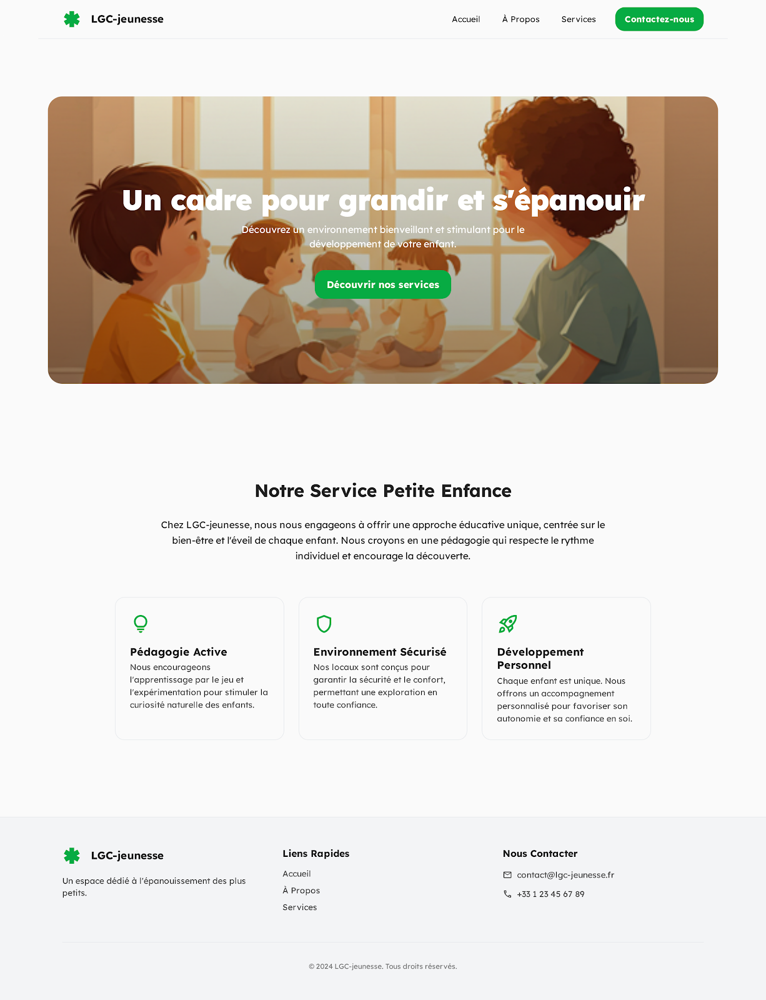

# LGC‑jeunesse — Page d’accueil ✨

 

Bienvenue dans le dépôt de la page d’accueil de LGC‑jeunesse — « Un cadre pour grandir et s’épanouir ». Ce projet est une landing page moderne, responsive et rapide, pensée pour présenter l’initiative et faciliter la prise de contact. 🚀

## 🎯 Objectif

Offrir une vitrine claire et accessible de LGC‑jeunesse, avec une mise en page soignée, un contraste lisible et un design adaptable à tous les écrans. 📱

## ✨ Fonctionnalités clés

- Mise en page responsive et accessible (balises ARIA, navigation claire) ♿
- Design moderne avec palette personnalisée et typographie soignée 🎨
- Mode sombre via `darkMode: "class"` 🌙
- En‑tête avec navigation et bouton d’appel à l’action 🧭
- Section héros, cartes de contenu et pied de page structurés 🧩

## 🛠️ Pile technique

- HTML statique (`code.html`)
- Tailwind CSS via CDN (avec configuration personnalisée dans `js/app.js`)
- Google Fonts (Lexend) + Material Symbols
- JavaScript léger pour la configuration Tailwind ⚙️

## 📂 Structure

- `code.html` — Page principale
- `js/app.js` — Configuration Tailwind (couleurs, polices, arrondis)
- `screen.png` — Aperçu de l’interface

## ▶️ Démarrer localement

Il suffit d’ouvrir `code.html` dans votre navigateur. Aucun build ni dépendance n’est requis. 🧑‍💻

## 🖼️ Aperçu

---

💡 Astuce: pour activer le mode sombre, ajoutez la classe `dark` sur l’élément `<html>`.
